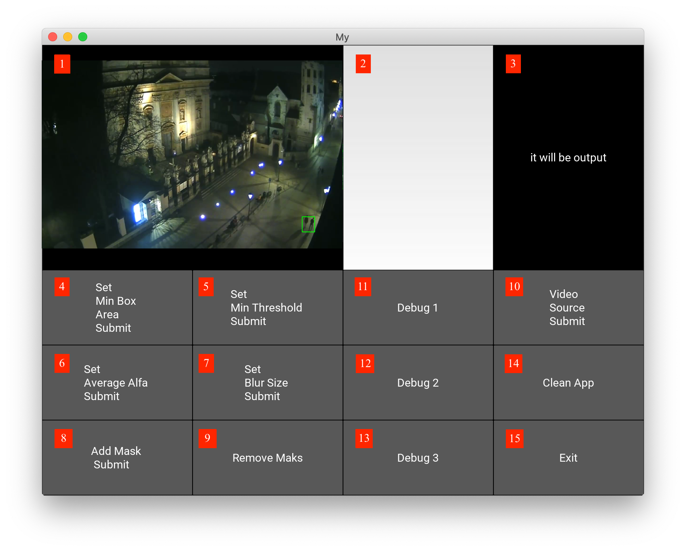

# Motion Detector
---
This application allows you to check for any movement in the area of sight of the camera.  
---

### Main view
<b>1.</b> Camera view - moving elements are surrounded with a green box
<b>2.</b> Input area - here you can enter a number to alter the value of any changable parameter
<b>3.</b> Output view - the program informs you about any changes and alerts you in case of any errors

### Changable parameters
<b>4.</b> Min Box Area - minimal area of a box that should be concidered a movement (in pixels, e.g. 10000 might be 50x200 box)
<b>5.</b> Min Threshold - minimal value of movement that should be considered a movement
<b>6.</b> Average Alfa - change of the background speed, between 0 and 1.
<b>7.</b> Blur Size - the bigger the value, the larger boxes will be detected
<b>8.</b> Mask - you can separate the area that you would like to observe from the area that you are not interested in, by adding a path to an image, consisting of black and white pixels. Pixels from the camera frame, corresponding to the white pixels from the mask are being processed while the others are not

### Debug options
<b>11.</b> Setting view back to normal
<b>12.</b> Only the background frame
<b>13.</b> Threshold frame - only the parts, where movement has been detected

### Removing parameters
<b>9.</b> Remove mask
<b>14.</b> Clean App - sets all the parameters to the default values
<b>15.</b> Exit the app